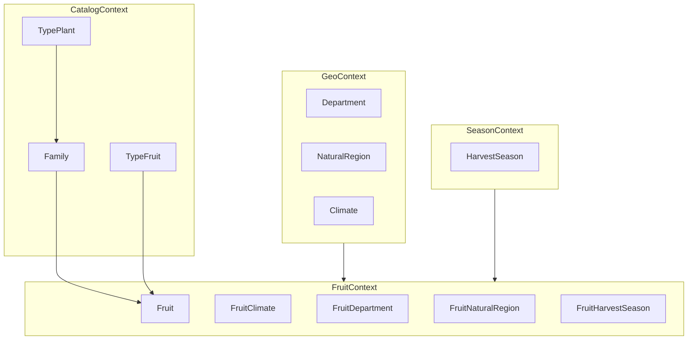

# Bounded Contexts

Define los módulos del dominio antes de crear carpetas en el código. Cada bounded context se refleja como subcarpeta **dentro de cada capa** (layer-first), no como módulo NestJS autocontenido.

## Context Map

## Contextos y responsabilidades

### CatalogContext

Catálogos de referencia botánica. CRUD simple, sin relaciones N:M.

| Entidad | Descripción |
|---------|-------------|
| `TypePlant` | Hábito de crecimiento (árbol, arbusto, enredadera) |
| `Family` | Familia botánica — **FK a `TypePlant`** |
| `TypeFruit` | Clasificación morfológica (baya, drupa, agregado) |

Relación clave: `TypePlant` 1→N `Family` 1→N `Fruit`. La fruta **no** tiene FK directa a `TypePlant`.

**Subcarpetas en código:** `domain/families/`, `domain/type-plants/`, `domain/type-fruits/`

### FruitContext

Agregado central del sistema. Contiene la entidad `Fruit` y las tablas puente N:M.

| Entidad | Descripción |
|---------|-------------|
| `Fruit` | Fruta nativa colombiana (agregado raíz) |
| `FruitClimate` | Puente N:M con Climate |
| `FruitDepartment` | Puente N:M con Department |
| `FruitNaturalRegion` | Puente N:M con NaturalRegion |
| `FruitHarvestSeason` | Puente N:M con HarvestSeason |

**Subcarpetas en código:** `domain/fruits/`, `application/fruits/`, etc.

### GeoContext

Contexto geográfico y climático de Colombia.

| Entidad | Descripción |
|---------|-------------|
| `Department` | Departamentos colombianos (código DANE) |
| `NaturalRegion` | Regiones naturales (Andina, Amazónica, Caribe…) |
| `Climate` | Zonas climáticas |

**Subcarpetas en código:** `domain/departments/`, `domain/natural-regions/`, `domain/climates/`

### SeasonContext

Temporadas de cosecha.

| Entidad | Descripción |
|---------|-------------|
| `HarvestSeason` | Ventana de cosecha (`start_month`, `end_month`) — sin campo `name` |

**Subcarpetas en código:** `domain/harvest-seasons/`

## Módulos NestJS derivados (registro en `app.module.ts`)

Estos no son carpetas raíz; son **registros de providers y controllers** dentro de la estructura layer-first:

| Recurso HTTP | Bounded context | Prioridad MVP |
|--------------|-----------------|---------------|
| `fruits` | FruitContext | Alta — vertical slice inicial |
| `families` | CatalogContext | Media |
| `type-plants` | CatalogContext | Media |
| `type-fruits` | CatalogContext | Media |
| `climates` | GeoContext | Media |
| `departments` | GeoContext | Media |
| `natural-regions` | GeoContext | Baja |
| `harvest-seasons` | SeasonContext | Baja |

## Reglas de dependencia entre contextos

- **FruitContext** depende de Catalog, Geo y Season (FKs y tablas puente).
- **Catalog, Geo y Season** no dependen de FruitContext.
- Ningún contexto importa implementaciones de infraestructura de otro contexto; solo comparten puertos de dominio cuando es necesario.

## Referencia

- ERD completo: [`../database/schema.dbml`](../database/schema.dbml)
- Glosario: [`../database/glossary.md`](../database/glossary.md)
