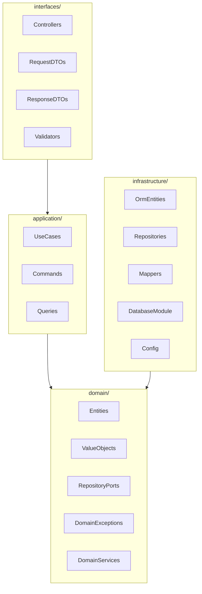

# Capas Clean Architecture

Define qué va en cada capa, las dependencias permitidas y las prohibidas. Este proyecto usa **cuatro capas canónicas** con estructura **layer-first**.

## Diagrama de capas



## Regla de oro

```
interfaces/ → application/ → domain/ ← infrastructure/
```

- `domain/` **nunca** importa de `infrastructure/` ni de `interfaces/`.
- `application/` **nunca** importa de `infrastructure/` ni de `interfaces/`.
- `infrastructure/` implementa los puertos definidos en `domain/`.
- `interfaces/` adapta HTTP (u otros protocolos) hacia los use cases.

## Contenido por capa

### `domain/` — Núcleo del negocio

| Qué va aquí | Qué NO va aquí |
|-------------|----------------|
| Entidades de dominio (`Fruit`) | Decoradores NestJS (`@Injectable`, `@Controller`) |
| Value Objects (`CommonName`) | TypeORM (`@Entity`, `@Column`) |
| Puertos / interfaces de repositorio (`FruitRepositoryPort`) | DTOs HTTP |
| Excepciones de dominio (`FruitNotFoundException`, etc.) | `HttpException` de NestJS |
| Servicios de dominio (reglas puras) | Lógica de persistencia |

**Ejemplos de archivos:**

- `domain/fruits/entities/fruit.entity.ts`
- `domain/fruits/exceptions/fruit.exceptions.ts` — varias clases por bounded context

Ver convención de excepciones: [`06-domain-exceptions.md`](./06-domain-exceptions.md)

### `application/` — Casos de uso

| Qué va aquí | Qué NO va aquí |
|-------------|----------------|
| Use Cases (`CreateFruitUseCase`) | Controllers |
| Commands / Queries de entrada al use case | Entidades ORM |
| Orquestación de reglas de negocio | SQL directo |
| Inyección de puertos (interfaces del dominio) | DTOs HTTP |

**Convención:** un use case = una clase = un método público `execute()`.

**Ejemplo de archivo:** `application/fruits/use-cases/create-fruit/create-fruit.use-case.ts`

### `infrastructure/` — Detalles técnicos

| Qué va aquí | Qué NO va aquí |
|-------------|----------------|
| Entidades TypeORM (`FruitOrmEntity`) | Reglas de negocio |
| Implementaciones de repositorio (`PostgresFruitRepository`) | Controllers |
| Mappers (`FruitMapper.toDomain()` / `toPersistence()`) | Use Cases |
| `DatabaseModule`, configuración, migraciones | DTOs HTTP |

**Ejemplo de archivo:** `infrastructure/persistence/fruits/postgres-fruit.repository.ts`

### `interfaces/` — Adaptadores de entrada/salida

| Qué va aquí | Qué NO va aquí |
|-------------|----------------|
| Controllers REST (`FruitsController`) | Lógica de negocio |
| Request/Response DTOs | Entidades de dominio expuestas directamente |
| Validación de entrada (`class-validator`) | Repositorios concretos |
| `app.module.ts` (composición NestJS) | Entidades ORM |

**Nota:** se usa `interfaces/` en lugar de `presentation/` porque esta capa puede adaptar no solo HTTP sino también CLI, eventos o GraphQL en el futuro.

**Ejemplo de archivo:** `interfaces/http/fruits/fruits.controller.ts`

## Mapa de dependencias (imports permitidos)

| Desde ↓ / Hacia → | domain | application | infrastructure | interfaces |
|-------------------|--------|-------------|----------------|------------|
| **domain** | ✓ | ✗ | ✗ | ✗ |
| **application** | ✓ | ✓ | ✗ | ✗ |
| **infrastructure** | ✓ | ✗ | ✓ | ✗ |
| **interfaces** | ✗ | ✓ | ✗ | ✓ |

## Inversión de dependencias con NestJS

Los puertos viven en `domain/`. Las implementaciones viven en `infrastructure/`. NestJS conecta ambos en `app.module.ts`:

```typescript
// interfaces/app.module.ts (composición)
{
  provide: FRUIT_REPOSITORY,           // token del puerto
  useClass: PostgresFruitRepository,   // implementación infra
}
```

El use case solo conoce el puerto:

```typescript
// application/fruits/use-cases/create-fruit/create-fruit.use-case.ts
constructor(
  @Inject(FRUIT_REPOSITORY)
  private readonly fruitRepository: FruitRepositoryPort,
) {}
```

## Anti-patrones a evitar

| Anti-patrón | Por qué está mal | Alternativa |
|-------------|------------------|-------------|
| TypeORM en `domain/` | Acopla el núcleo a la BD | Entidad de dominio pura + mapper |
| Use case que importa controller | Invierte el flujo | Controller llama al use case |
| God Service de 500 líneas | Mezcla responsabilidades | Un use case por acción |
| Exponer entidad ORM en response | Filtra detalles de persistencia | Response DTO en `interfaces/` |
| Lógica de negocio en controller | Controller solo adapta | Mover a use case o domain service |
| `NotFoundException` en controller | Acopla HTTP al flujo | Lanzar excepción de dominio; filter en `interfaces/` |

## Referencias

- Estructura layer-first: [`03-layer-first-structure.md`](./03-layer-first-structure.md)
- Secuencia de flujo: [`04-sequence-create-fruit.md`](./04-sequence-create-fruit.md)
- Excepciones de dominio: [`06-domain-exceptions.md`](./06-domain-exceptions.md)
