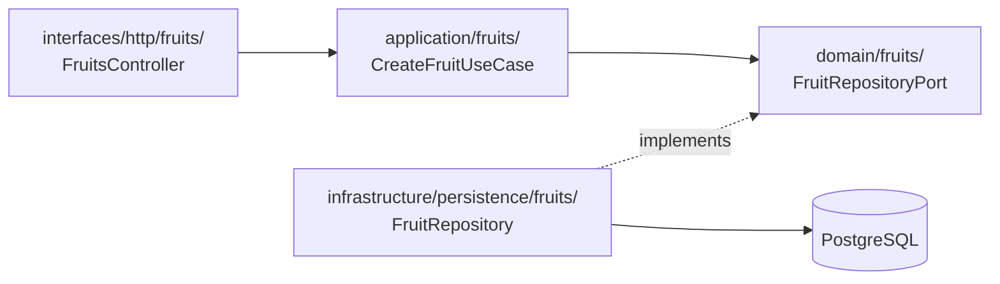

# Estructura layer-first

Plantilla repetible de carpetas organizada **por capas** (no por módulos NestJS autocontenidos). Cada bounded context aparece como subcarpeta dentro de cada capa.

## Vista general

```
src/
├── domain/
│   ├── fruits/
│   ├── families/
│   ├── climates/
│   ├── departments/
│   ├── natural-regions/
│   ├── harvest-seasons/
│   ├── type-plants/
│   ├── type-fruits/
│   └── shared/
│       └── value-objects/
├── application/
│   ├── fruits/
│   │   └── use-cases/
│   ├── families/
│   │   └── use-cases/
│   └── ...
├── infrastructure/
│   ├── persistence/
│   │   ├── fruits/
│   │   ├── families/
│   │   └── database.module.ts
│   └── config/
└── interfaces/
    ├── http/
    │   ├── fruits/
    │   ├── families/
    │   ├── health/
    │   ├── departments/
    │   ├── climates/
    │   └── ... (catálogos)
    └── app.module.ts
```

## Detalle por capa — bounded context `fruits`

### `domain/fruits/`

```
domain/fruits/
├── entities/
│   └── fruit.entity.ts              # Entidad de dominio pura
├── repositories/
│   ├── fruit.repository.port.ts     # Interface (puerto)
│   └── fruit.repository.token.ts    # Token DI
└── exceptions/
    └── fruit.exceptions.ts          # Todas las excepciones del contexto
```

### `application/fruits/`

```
application/fruits/
└── use-cases/
    ├── create-fruit/
    │   ├── create-fruit.use-case.ts
    │   └── create-fruit.command.ts
    └── get-fruit-by-id/
        ├── get-fruit-by-id.use-case.ts
        └── get-fruit-by-id.query.ts
```

### `infrastructure/persistence/fruits/`

```
infrastructure/persistence/fruits/
├── fruit.orm-entity.ts              # TypeORM @Entity
├── fruit.mapper.ts                  # toDomain() / toPersistence()
└── fruit.repository.ts              # Implementa FruitRepositoryPort
```

### `interfaces/http/fruits/`

```
interfaces/http/fruits/
├── fruits.controller.ts
└── dto/
    ├── create-fruit.request.dto.ts
    ├── fruit.response.dto.ts
    └── fruit-list.response.dto.ts
```

## Diagrama de componentes — flujo CreateFruit



## Checklist para agregar un nuevo bounded context

Ejemplo: agregar `climates`.

1. **domain/climates/** — entidad + puerto + excepciones
2. **application/climates/use-cases/** — create, get-by-id, list, update, delete
3. **infrastructure/persistence/climates/** — ORM entity + mapper + repository
4. **interfaces/http/climates/** — controller + DTOs
5. **interfaces/app.module.ts** — registrar providers y controller
6. **Migración TypeORM** — tabla `climates`
7. **Test unitario** — al menos un use case con mock del puerto

## Convenciones de naming

| Artefacto | Patrón de archivo | Clase / símbolo |
|-----------|-------------------|-----------------|
| Entidad dominio | `fruit.entity.ts` | `Fruit` |
| Puerto repositorio | `fruit.repository.port.ts` | `FruitRepositoryPort` |
| Excepciones dominio | `{context}.exceptions.ts` | `FruitNotFoundException`, etc. |
| Token DI | `fruit.repository.token.ts` | `FRUIT_REPOSITORY` |
| Use case | `create-fruit.use-case.ts` | `CreateFruitUseCase` |
| Command | `create-fruit.command.ts` | `CreateFruitCommand` |
| ORM entity | `fruit.orm-entity.ts` | `FruitOrmEntity` |
| Repository impl | `fruit.repository.ts` | `FruitRepository` |
| Mapper | `fruit.mapper.ts` | `FruitMapper` |
| Controller | `fruits.controller.ts` | `FruitsController` |
| Request DTO | `create-fruit.request.dto.ts` | `CreateFruitRequestDto` |
| Response DTO | `fruit.response.dto.ts` | `FruitResponseDto` |

## Registro en NestJS (`app.module.ts`)

En layer-first, la composición de dependencias se centraliza en un solo módulo raíz:

```typescript
@Module({
  imports: [DatabaseModule, ConfigModule, HealthModule, FamiliesModule, FruitsModule],
  // Catálogos: DepartmentsModule, ClimatesModule, ...
})
export class AppModule {}
```

Opcionalmente, puedes crear **feature modules** de NestJS solo para agrupar providers/controllers de un contexto, pero las carpetas siguen siendo layer-first:

```
interfaces/http/fruits/fruits.module.ts   # solo wiring NestJS, sin lógica
```

## Layer-first vs module-first

| Aspecto | Layer-first (este proyecto) | Module-first |
|---------|----------------------------|--------------|
| Raíz de carpetas | `domain/`, `application/`, … | `modules/fruits/domain/`, … |
| Visibilidad de capas | Inmediata — la arquitectura es la estructura | Requiere entrar a cada módulo |
| Navegar un flujo | Saltas entre capas | Todo en una carpeta |
| Ideal para | Aprendizaje de Clean Architecture | Proyectos grandes con equipos por feature |
| NestJS idiomático | Menos común | Más común |

Ver ADR: [`adr/004-layer-first-structure.md`](./adr/004-layer-first-structure.md)

## Referencias

- Capas y dependencias: [`02-clean-architecture-layers.md`](./02-clean-architecture-layers.md)
- Excepciones de dominio: [`06-domain-exceptions.md`](./06-domain-exceptions.md)
- Guía paso a paso del primer slice: [`../guides/01-vertical-slice-fruits.md`](../guides/01-vertical-slice-fruits.md)
