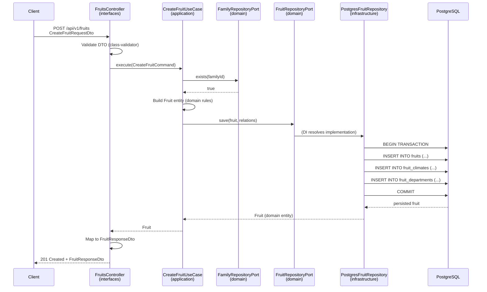

# Secuencia — CreateFruit

Flujo completo del caso de uso `CreateFruit`, incluyendo validación de FKs y asignación de relaciones N:M.

## Participantes

| Participante | Capa | Responsabilidad |
|--------------|------|-----------------|
| `Client` | Externo | Envía POST con datos de la fruta |
| `FruitsController` | interfaces | Valida DTO, delega al use case, mapea respuesta |
| `CreateFruitUseCase` | application | Orquesta reglas, valida FKs vía puertos, persiste |
| `FruitRepositoryPort` | domain | Contrato de persistencia |
| `PostgresFruitRepository` | infrastructure | Implementación TypeORM + transacción N:M |
| `FamilyRepositoryPort` | domain | Verificar que `familyId` existe |
| `PostgreSQL` | infrastructure | Almacenamiento |

## Diagrama de secuencia



## Flujo paso a paso

### 1. Entrada HTTP (`interfaces/`)

```
POST /api/v1/fruits
Content-Type: application/json

{
  "commonName": "Granadilla",
  "scientificName": "Passiflora ligularis",
  "description": "Fruta de la familia Passifloraceae",
  "familyId": 1,
  "typeFruitId": 2,
  "climateIds": [1],
  "departmentIds": [5, 11],
  "naturalRegionIds": [2],
  "harvestSeasonIds": [3]
}
```

El controller:
1. Recibe y valida el `CreateFruitRequestDto`.
2. Convierte el DTO a `CreateFruitCommand`.
3. Llama a `CreateFruitUseCase.execute(command)`.
4. Mapea el resultado a `FruitResponseDto`.
5. Retorna `201 Created`.

### 2. Caso de uso (`application/`)

`CreateFruitUseCase.execute(command)`:

1. Verifica que las FKs existen (`familyId`, `typeFruitId`) consultando los puertos correspondientes.
2. Valida reglas de dominio (nombres no vacíos, IDs de relaciones no duplicados).
3. Construye la entidad `Fruit` (dominio puro).
4. Llama a `FruitRepositoryPort.save(fruit, relations)`.
5. Retorna la entidad persistida.

### 3. Persistencia (`infrastructure/`)

`PostgresFruitRepository.save()`:

1. Abre transacción.
2. Mapea `Fruit` → `FruitOrmEntity`.
3. `INSERT INTO fruits`.
4. `INSERT INTO fruit_climates`, `fruit_departments`, etc. (tablas puente).
5. Commit (o rollback si falla).
6. Mapea `FruitOrmEntity` → `Fruit` y retorna.

### 4. Respuesta HTTP

```json
{
  "id": 1,
  "commonName": "Granadilla",
  "scientificName": "Passiflora ligularis",
  "description": "Fruta de la familia Passifloraceae",
  "family": {
    "id": 1,
    "name": "Passifloraceae",
    "typePlant": { "id": 3, "name": "Vine" }
  },
  "typeFruit": { "id": 2, "name": "Berry" },
  "climates": [{ "id": 1, "name": "Tropical" }],
  "departments": [{ "id": 5, "name": "Cundinamarca" }],
  "createdAt": "2026-06-20T22:00:00.000Z",
  "updatedAt": "2026-06-20T22:00:00.000Z"
}
```

## Errores esperados

| Código | Condición | Origen |
|--------|-----------|--------|
| `400 Bad Request` | DTO inválido (campos faltantes, ID inválido) | `interfaces/` (ValidationPipe) |
| `404 Not Found` | Fruta o FK no existe | `application/` → excepción de dominio |
| `409 Conflict` | `scientificName` duplicado | `DuplicateFruitScientificNameException` |
| `422 Unprocessable Entity` | Regla de dominio incumplida | `InvalidFruitDataException` |
| `500 Internal Server Error` | Error de BD no controlado | Global exception filter |

## Archivos involucrados (layer-first)

```
interfaces/http/fruits/
├── fruits.controller.ts
└── dto/create-fruit.request.dto.ts

application/fruits/use-cases/create-fruit/
├── create-fruit.use-case.ts
└── create-fruit.command.ts

domain/fruits/
├── entities/fruit.entity.ts
├── repositories/
│   ├── fruit.repository.port.ts
│   └── fruit.repository.token.ts
└── exceptions/fruit.exceptions.ts

interfaces/http/filters/
└── domain-exception.filter.ts

infrastructure/persistence/fruits/
├── fruit.orm-entity.ts
├── fruit.mapper.ts
└── postgres-fruit.repository.ts
```

## Referencias

- Contrato API: [`../api/endpoints.md`](../api/endpoints.md)
- Guía de implementación: [`../guides/01-vertical-slice-fruits.md`](../guides/01-vertical-slice-fruits.md)
- Patrones aplicados: [`05-design-patterns.md`](./05-design-patterns.md)
- Excepciones de dominio: [`06-domain-exceptions.md`](./06-domain-exceptions.md)
