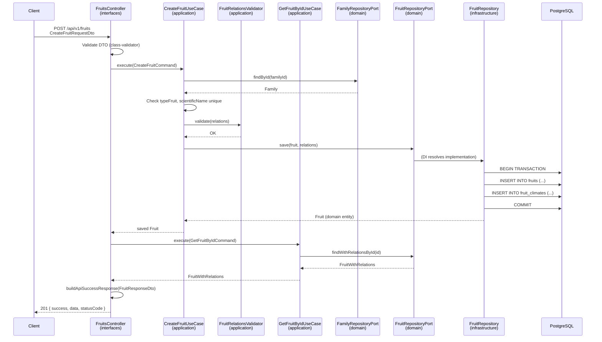

# Secuencia — CreateFruit

Flujo completo del caso de uso `CreateFruit`, incluyendo validación de FKs N:M, `FruitRelationsValidator`, re-fetch post-create y envelope de respuesta.

## Participantes

| Participante | Capa | Responsabilidad |
|--------------|------|-----------------|
| `Client` | Externo | Envía POST con datos de la fruta |
| `FruitsController` | interfaces | Valida DTO, delega al use case, re-fetch, envelope |
| `CreateFruitUseCase` | application | Orquesta reglas, valida FKs, persiste |
| `FruitRelationsValidator` | application | Valida que IDs N:M existen |
| `GetFruitByIdUseCase` | application | Re-fetch con relaciones anidadas post-create |
| `FruitRepositoryPort` | domain | Contrato de persistencia |
| `FruitRepository` | infrastructure | Implementación TypeORM + transacción N:M |
| `FamilyRepositoryPort` | domain | Verificar que `familyId` existe |
| `PostgreSQL` | infrastructure | Almacenamiento |

## Diagrama de secuencia



## Flujo paso a paso

### 1. Entrada HTTP (`interfaces/`)

El controller valida el DTO, ejecuta `CreateFruitUseCase`, luego **re-fetch** con `GetFruitByIdUseCase` para devolver relaciones anidadas completas, y envuelve en `{ success, data, statusCode }`.

### 2. Caso de uso (`application/`)

`CreateFruitUseCase.execute(command)`:

1. Verifica `familyId` y `typeFruitId` existen.
2. Verifica `scientificName` no duplicado.
3. Delega validación N:M a `FruitRelationsValidator.validate(relations)`.
4. Construye entidad `Fruit` y persiste vía `FruitRepositoryPort.save()`.

### 3. Persistencia (`infrastructure/`)

`FruitRepository.save()` abre transacción, inserta fruta y tablas puente, commit/rollback.

### 4. Respuesta HTTP (envelope)

```json
{
  "success": true,
  "data": {
    "id": 1,
    "commonName": "Granadilla",
    "scientificName": "Passiflora ligularis",
    "family": {
      "id": 1,
      "name": "Passifloraceae",
      "typePlant": { "id": 3, "name": "Vine" }
    },
    "typeFruit": { "id": 2, "name": "Berry" },
    "climates": [{ "id": 1, "name": "Tropical" }],
    "departments": [{ "id": 5, "name": "Cundinamarca", "code": "CUN" }],
    "createdAt": "2026-06-20T22:00:00.000Z",
    "updatedAt": "2026-06-20T22:00:00.000Z"
  },
  "statusCode": 201
}
```

## Errores esperados

| Código | Condición | Origen |
|--------|-----------|--------|
| `400 Bad Request` | DTO inválido | `interfaces/` (ValidationPipe) |
| `404 Not Found` | FK no existe | `application/` → excepción de dominio |
| `409 Conflict` | `scientificName` duplicado | `DuplicateFruitScientificNameException` |
| `422 Unprocessable Entity` | Regla de dominio incumplida | `InvalidFruitDataException` |

## Archivos involucrados

```
interfaces/http/fruits/fruits.controller.ts
application/fruits/use-cases/create-fruit/create-fruit.use-case.ts
application/fruits/services/fruit-relations.validator.ts
application/fruits/use-cases/get-fruit-by-id/get-fruit-by-id.use-case.ts
infrastructure/persistence/fruits/fruit.repository.ts
```

## Referencias

- Contrato API: [`../api/endpoints.md`](../api/endpoints.md)
- Patrones: [`05-design-patterns.md`](./05-design-patterns.md)
