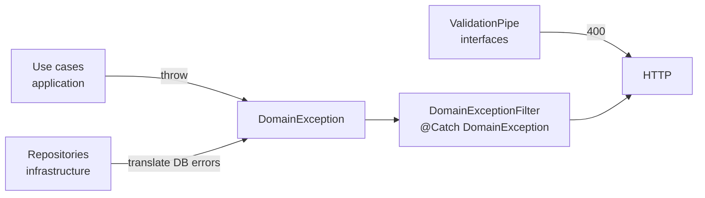

# Excepciones de dominio

Convenciones para definir, organizar y mapear excepciones de negocio en la capa `domain/`.

## Convención de archivos

Las excepciones se agrupan **por bounded context** en un solo archivo:

```
domain/fruits/exceptions/fruit.exceptions.ts
domain/families/exceptions/family.exceptions.ts
domain/climates/exceptions/climate.exceptions.ts
```

| ✅ Hacer | ❌ Evitar |
|---------|----------|
| Un archivo `{context}.exceptions.ts` por contexto | Mezclar excepciones de distintos contextos |
| Extender `DomainException` con `kind` explícito | `HttpException` o `NotFoundException` de NestJS en `domain/` |
| Mensajes de negocio claros en `super(...)` | Lanzar strings sin clase tipada |

Las excepciones de dominio **no conocen HTTP**. La traducción a códigos HTTP ocurre en `interfaces/http/shared/filters/domain-exception.filter.ts`.

---

## Clase base — `DomainException`

```typescript
// src/domain/shared/exceptions/domain-exception.base.ts
export enum DomainExceptionKind {
    NOT_FOUND = 'NOT_FOUND',
    CONFLICT = 'CONFLICT',
    INVALID_DATA = 'INVALID_DATA',
}

export abstract class DomainException extends Error {
    abstract readonly kind: DomainExceptionKind;
}
```

---

## Plantilla por contexto

```typescript
// src/domain/fruits/exceptions/fruit.exceptions.ts
export class FruitNotFoundException extends DomainException {
    readonly kind = DomainExceptionKind.NOT_FOUND;

    constructor(readonly fruitId: number) {
        super(`Fruit with id ${fruitId} not found.`);
        this.name = 'FruitNotFoundException';
    }
}
```

Elementos obligatorios:

1. `extends DomainException`
2. `readonly kind` con el valor del enum
3. Datos útiles en propiedades (`fruitId`, `scientificName`, etc.)
4. `this.name = 'NombreDeLaClase'`

---

## Excepciones implementadas

### `fruits`

| Excepción | Cuándo se lanza | HTTP |
|-----------|-----------------|------|
| `FruitNotFoundException` | `GetFruitByIdUseCase`: `findByIdWithRelations` retorna `null` | **404** |
| `DuplicateFruitScientificNameException` | `CreateFruitUseCase`: nombre científico duplicado | **409** |
| `InvalidFruitDataException` | Regla de dominio incumplida | **422** |

### Catálogos (todos los contextos)

Cada catálogo expone al menos `*NotFoundException` con `kind = NOT_FOUND`:

| Contexto | Archivo | Ejemplo |
|----------|---------|---------|
| families | `family.exceptions.ts` | `FamilyNotFoundException` |
| type-fruits | `type-fruit.exceptions.ts` | `TypeFruitNotFoundException` |
| climates | `climate.exceptions.ts` | `ClimateNotFoundException` |
| departments | `department.exceptions.ts` | `DepartmentNotFoundException` |
| natural-regions | `natural-region.exceptions.ts` | `NaturalRegionNotFoundException` |
| harvest-seasons | `harvest-season.exceptions.ts` | `HarvestSeasonNotFoundException` |
| type-plants | `type-plant.exceptions.ts` | `TypePlantNotFoundException` |

`CreateFruitUseCase` lanza `FamilyNotFoundException` y `TypeFruitNotFoundException` cuando las FK no existen. `FruitRelationsValidator` lanza las excepciones de los catálogos N:M.

---

## Flujo de mapeo HTTP



| `DomainExceptionKind` | HTTP status |
|-----------------------|-------------|
| `NOT_FOUND` | 404 |
| `CONFLICT` | 409 |
| `INVALID_DATA` | 422 |

---

## Exception filter (implementación actual)

```typescript
// src/interfaces/http/shared/filters/domain-exception.filter.ts
@Catch(DomainException)
export class DomainExceptionFilter implements ExceptionFilter {
    catch(exception: DomainException, host: ArgumentsHost): void {
        const status = this.resolveStatus(exception.kind);
        response.status(status).json(buildApiErrorResponse(status, exception.message));
    }
}
```

Registrado en `main.ts` junto con `UnhandledExceptionFilter`:

```typescript
app.useGlobalFilters(new UnhandledExceptionFilter(), new DomainExceptionFilter());
```

---

## Quién lanza qué — `CreateFruitUseCase`

| Condición | Capa | Excepción |
|-----------|------|-----------|
| DTO inválido | `interfaces/` (ValidationPipe) | — → **400** |
| `familyId` no existe | `application/` | `FamilyNotFoundException` |
| `typeFruitId` no existe | `application/` | `TypeFruitNotFoundException` |
| ID N:M inexistente | `application/` (`FruitRelationsValidator`) | excepción del catálogo correspondiente |
| `scientificName` duplicado | `application/` | `DuplicateFruitScientificNameException` |

---

## Anti-patrones

| ❌ Mal | ✅ Bien |
|-------|--------|
| `throw new NotFoundException()` en controller | `throw new FruitNotFoundException(id)` en use case |
| Excepción que extiende `HttpException` en `domain/` | `extends DomainException` |
| Listar cada excepción en `@Catch(...)` | `@Catch(DomainException)` — una sola clase base |
| Un `.ts` por excepción (obligatorio) | Un `{context}.exceptions.ts` por bounded context |

---

## Referencias

- Secuencia CreateFruit: [`04-sequence-create-fruit.md`](./04-sequence-create-fruit.md)
- Código: [`../../src/domain/shared/exceptions/domain-exception.base.ts`](../../src/domain/shared/exceptions/domain-exception.base.ts)
