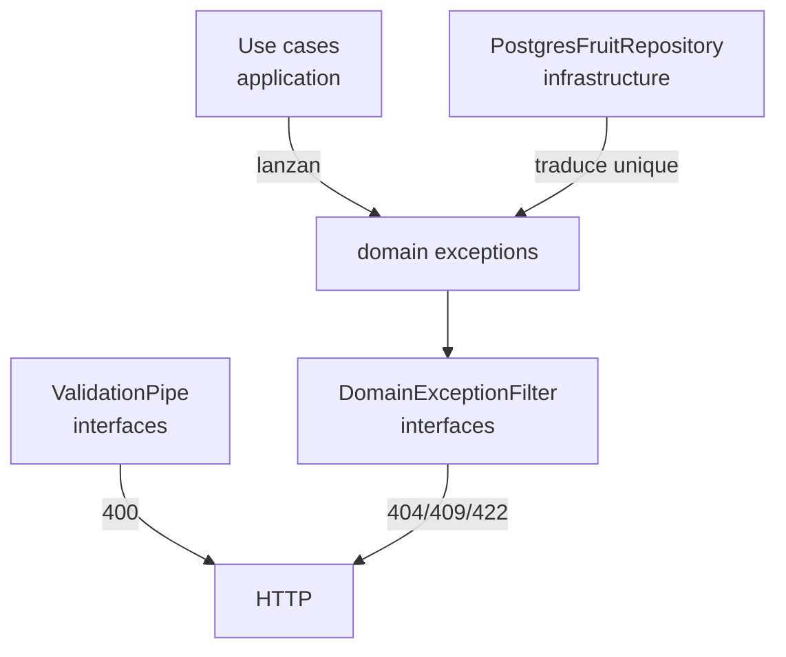

# Excepciones de dominio

Convenciones para definir, organizar y mapear excepciones de negocio en la capa `domain/`.

## Convención de archivos

Las excepciones se agrupan **por bounded context** en un solo archivo:

```
domain/fruits/exceptions/fruit.exceptions.ts
domain/families/exceptions/family.exceptions.ts
domain/climates/exceptions/climate.exceptions.ts
```

| ✅ Hacer | ❌ Evitar |
|---------|----------|
| Un archivo `{context}.exceptions.ts` por contexto | Mezclar excepciones de `fruits` y `families` en el mismo archivo |
| Varias clases en el mismo archivo si son del mismo contexto | `HttpException` o `NotFoundException` de NestJS en `domain/` |
| `extends Error` + `this.name` explícito | Lanzar strings o errores genéricos sin tipo |

Las excepciones de dominio **no conocen HTTP**. La traducción a 404/409/422 ocurre en `interfaces/` (exception filter).

---

## Plantilla de excepción

```typescript
export class FruitNotFoundException extends Error {
  constructor(readonly fruitId: number) {
    super(`Fruit with id ${fruitId} not found.`);
    this.name = 'FruitNotFoundException';
  }
}
```

Elementos obligatorios:

1. `extends Error`
2. Datos útiles en propiedades (`fruitId`, `scientificName`, etc.)
3. `super('mensaje de negocio claro')`
4. `this.name = 'NombreDeLaClase'`

---

## Estado actual — `domain/fruits/exceptions/fruit.exceptions.ts`

Implementado en el repositorio:

| Excepción | Cuándo se lanza | HTTP (en filter) |
|-----------|-----------------|------------------|
| `FruitNotFoundException` | `GetFruitByIdUseCase`: `findById` retorna `null` | **404** |
| `FruitScientificNameNotFoundException` | Use case que busca por `scientificName` y no existe | **404** |
| `DuplicateFruitScientificNameException` | `CreateFruitUseCase` o repositorio: `scientific_name` duplicado | **409** |
| `InvalidFruitDataException` | Regla de dominio incumplida (nombres vacíos, etc.) | **422** |

### Ejemplo del archivo actual

```typescript
export class FruitNotFoundException extends Error {
  constructor(readonly fruitId: number) {
    super(`Fruit with id ${fruitId} not found.`);
    this.name = 'FruitNotFoundException';
  }
}

export class FruitScientificNameNotFoundException extends Error {
  constructor(readonly scientificName: string) {
    super(`Fruit with scientific name ${scientificName} not found.`);
    this.name = 'FruitScientificNameNotFoundException';
  }
}

export class DuplicateFruitScientificNameException extends Error {
  constructor(readonly scientificName: string) {
    super(`Fruit with scientific name ${scientificName} already exists.`);
    this.name = 'DuplicateFruitScientificNameException';
  }
}

export class InvalidFruitDataException extends Error {
  constructor(reason: string) {
    super(`Invalid fruit data: ${reason}.`);
    this.name = 'InvalidFruitDataException';
  }
}
```

---

## Quién lanza qué — por capa



| Capa | Responsabilidad |
|------|-----------------|
| **`interfaces/`** | DTO inválido → **400** (ValidationPipe). Filtro global → traduce excepciones de dominio a HTTP |
| **`application/`** | Detecta reglas de negocio incumplidas y **lanza** excepciones de dominio |
| **`domain/`** | **Define** las clases de excepción |
| **`infrastructure/`** | Captura errores de BD (ej. unique constraint) y lanza excepción de dominio equivalente |

---

## `GetFruitByIdUseCase`

| Condición | Quién lanza | Excepción |
|-----------|-------------|-----------|
| `id` no es entero | `ParseIntPipe` en controller | — → **400** |
| `findById` retorna `null` | `GetFruitByIdUseCase` | `FruitNotFoundException` |

```typescript
const fruit = await this.fruitRepository.findById(id);
if (!fruit) {
  throw new FruitNotFoundException(id);
}
return fruit;
```

---

## `CreateFruitUseCase`

| Condición | Quién lanza | Excepción |
|-----------|-------------|-----------|
| DTO mal formado | `ValidationPipe` | — → **400** |
| Nombres vacíos / regla de dominio | `CreateFruitUseCase` | `InvalidFruitDataException` |
| `familyId` no existe | `CreateFruitUseCase` | `FamilyNotFoundException` *(families)* |
| `typeFruitId` no existe | `CreateFruitUseCase` | `TypeFruitNotFoundException` *(type-fruits)* |
| `climateId` / `departmentId` / etc. no existe | `CreateFruitUseCase` | excepción del catálogo correspondiente |
| `scientific_name` duplicado | `PostgresFruitRepository` *(recomendado)* o use case | `DuplicateFruitScientificNameException` |

---

## Exception filter (capa `interfaces/`)

```typescript
@Catch(
  FruitNotFoundException,
  FruitScientificNameNotFoundException,
  DuplicateFruitScientificNameException,
  InvalidFruitDataException,
)
export class DomainExceptionFilter implements ExceptionFilter {
  catch(exception: Error, host: ArgumentsHost): void {
    const response = host.switchToHttp().getResponse<Response>();
    const status = this.resolveStatus(exception);
    response.status(status).json({
      statusCode: status,
      message: exception.message,
      error: this.resolveErrorLabel(status),
    });
  }
}
```

Registrar en `main.ts`:

```typescript
app.useGlobalFilters(new DomainExceptionFilter());
```

---

## Excepciones de otros contextos (pendientes)

Al implementar validación de FKs en `CreateFruitUseCase`, crear archivos equivalentes:

```
domain/families/exceptions/family.exceptions.ts       → FamilyNotFoundException
domain/type-fruits/exceptions/type-fruit.exceptions.ts → TypeFruitNotFoundException
domain/climates/exceptions/climate.exceptions.ts       → ClimateNotFoundException
```

Mismo patrón: un archivo por contexto, varias clases si hace falta.

---

## Anti-patrones

| ❌ Mal | ✅ Bien |
|-------|--------|
| `throw new NotFoundException()` en controller | `throw new FruitNotFoundException(id)` en use case |
| Excepción de dominio que extiende `HttpException` | `extends Error` en `domain/` |
| Mensaje de error hardcodeado sin clase tipada | Clase con `name` explícito para el filter |
| Una carpeta con un `.ts` por excepción (obligatorio) | Un `{context}.exceptions.ts` por bounded context |

---

## Referencias

- Secuencia CreateFruit: [`04-sequence-create-fruit.md`](./04-sequence-create-fruit.md)
- Guía vertical slice: [`../guides/01-vertical-slice-fruits.md`](../guides/01-vertical-slice-fruits.md)
- Código actual: [`../../src/domain/fruits/exceptions/fruit.exceptions.ts`](../../src/domain/fruits/exceptions/fruit.exceptions.ts)
