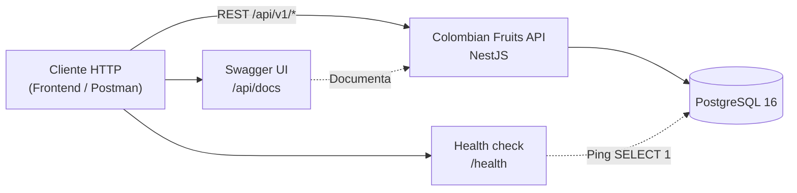

# Diagrama — Contexto del sistema

Vista de alto nivel: quién interactúa con qué.

## Notas

- El prefijo global es `api/v1`; `/health` y `/api/docs` quedan **fuera** del prefijo.
- Swagger documenta el contrato con envelope `{ success, data, statusCode }`.
- En Docker, PostgreSQL corre como servicio `postgres`; la API espera `DATABASE_HOST=postgres`.

## Referencias

- [Endpoints](../../api/endpoints.md)
- [Deployment Docker](./05-deployment-docker.md)
