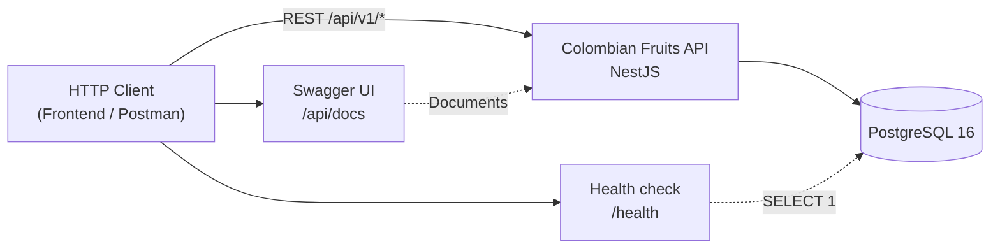

# Diagram: System Context

**Type:** Architecture diagram  
**Tool:** Mermaid (`flowchart LR`)  
**Purpose:** Show who interacts with the API, PostgreSQL, Swagger, and health check.

---

## Diagram

---

## Notes

- Global API prefix is `api/v1`; `/health` and `/api/docs` sit **outside** that prefix.
- Success responses use envelope `{ success, data, statusCode }`.
- In Docker Compose, the API uses `DATABASE_HOST=postgres`.

## References

- [API endpoints](../../api/endpoints.md)
- [Docker deployment](./05-deployment-docker.md)
