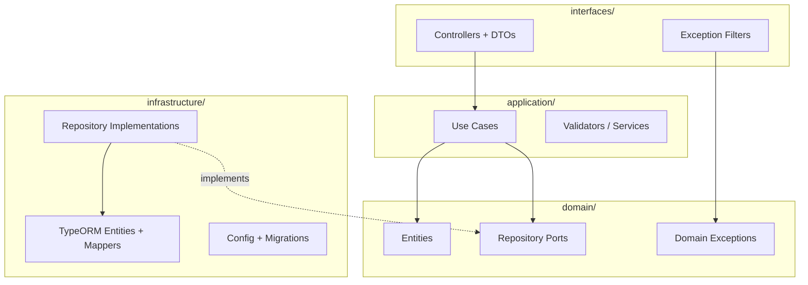

# Diagrama — Capas Clean Architecture

Regla de dependencia: las capas externas dependen de las internas; el dominio no conoce infraestructura ni HTTP.



## Regla de dependencia

```
interfaces → application → domain ← infrastructure
```

- **domain/** — lógica pura, sin NestJS ni TypeORM.
- **application/** — orquesta casos de uso; depende solo de puertos del dominio.
- **infrastructure/** — implementa puertos (TypeORM, config).
- **interfaces/** — adaptadores HTTP; convierte DTOs ↔ Commands/Queries.

## Referencias

- [Capas detalladas](../02-clean-architecture-layers.md)
- [Estructura layer-first](../03-layer-first-structure.md)
