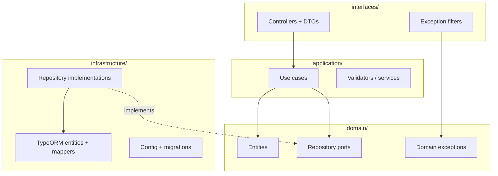

# Diagram: Clean Architecture Layers

**Type:** Architecture diagram  
**Tool:** Mermaid (`flowchart TB`)  
**Purpose:** Illustrate layer-first folders and the dependency rule.

---

## Diagram



---

## Dependency rule

```
interfaces → application → domain ← infrastructure
```

| Layer | Folder | Responsibility |
|-------|--------|----------------|
| Domain | `src/domain/` | Pure business model, ports, exceptions |
| Application | `src/application/` | Use cases; depends only on domain ports |
| Infrastructure | `src/infrastructure/` | TypeORM, config, migrations |
| Interfaces | `src/interfaces/` | HTTP adapters, DTOs, NestJS modules |

## References

- [Clean Architecture layers](../02-clean-architecture-layers.md)
- [Layer-first structure](../03-layer-first-structure.md)
