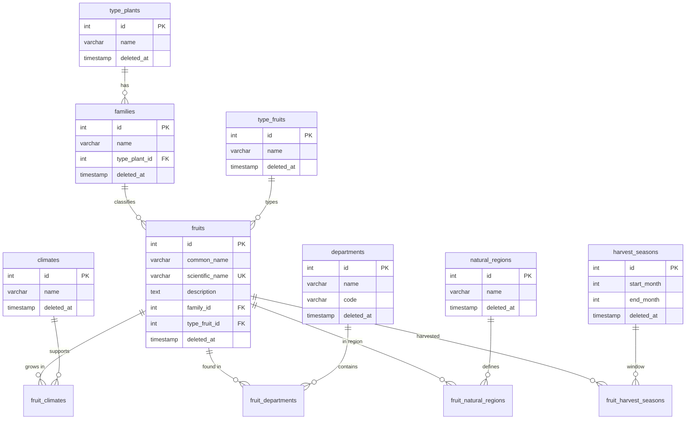

# Diagrama — Modelo entidad-relación (ERD)

Relaciones principales del catálogo de frutas colombianas.

## Notas

- `TypePlant` se alcanza vía `Family`, no hay FK directa en `fruits`.
- Tablas puente N:M: `fruit_climates`, `fruit_departments`, `fruit_natural_regions`, `fruit_harvest_seasons`.
- Soft delete (`deleted_at`) en catálogos y agregados principales.

## Referencias

- [schema.dbml](../../database/schema.dbml)
- [Glosario botánico](../../database/glossary.md)
