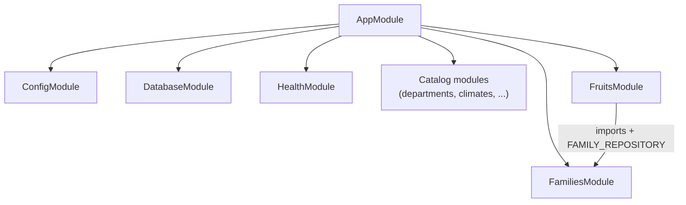

# Diagram: NestJS Modules

**Type:** Component / module diagram  
**Tool:** Mermaid (`flowchart TB`)  
**Purpose:** Show `AppModule` composition and cross-module dependencies (e.g. `FruitsModule` → `FamiliesModule`).

---

## Diagram

---

## Registered modules

| Module | Base path | Notes |
|--------|-----------|-------|
| `HealthModule` | `/health` | Outside `api/v1` |
| `DepartmentsModule` | `/api/v1/departments` | Includes `code` field |
| `TypePlantsModule` | `/api/v1/type-plants` | |
| `TypeFruitsModule` | `/api/v1/type-fruits` | |
| `ClimatesModule` | `/api/v1/climates` | |
| `NaturalRegionsModule` | `/api/v1/natural-regions` | |
| `HarvestSeasonsModule` | `/api/v1/harvest-seasons` | |
| `FamiliesModule` | `/api/v1/families` | Exports `FAMILY_REPOSITORY` |
| `FruitsModule` | `/api/v1/fruits` | Imports `FamiliesModule` |

## References

- [`src/interfaces/app.module.ts`](../../../src/interfaces/app.module.ts)
- [NestJS in this project (Study, Spanish)](../../wiki/Study/07-NestJS-En-Este-Proyecto.md)
