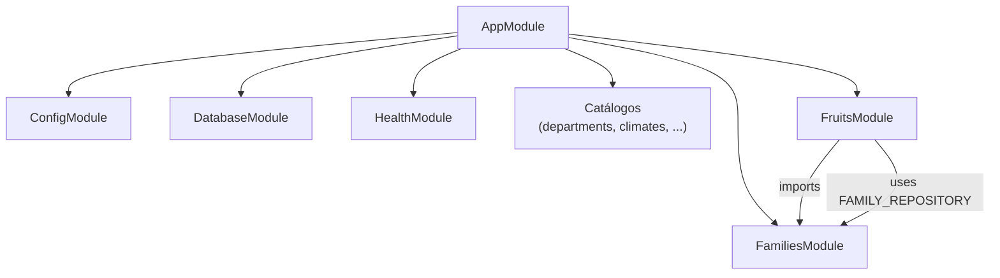

# Diagrama — Módulos NestJS

Composición de módulos HTTP y dependencias entre ellos.

## Módulos registrados en AppModule

| Módulo | Ruta base | Notas |
|--------|-----------|-------|
| `HealthModule` | `/health` | Fuera de `api/v1` |
| `DepartmentsModule` | `/api/v1/departments` | Incluye campo `code` |
| `TypePlantsModule` | `/api/v1/type-plants` | |
| `TypeFruitsModule` | `/api/v1/type-fruits` | |
| `ClimatesModule` | `/api/v1/climates` | |
| `NaturalRegionsModule` | `/api/v1/natural-regions` | |
| `HarvestSeasonsModule` | `/api/v1/harvest-seasons` | |
| `FamiliesModule` | `/api/v1/families` | Exporta `FAMILY_REPOSITORY` |
| `FruitsModule` | `/api/v1/fruits` | Importa `FamiliesModule` |

## Referencias

- [`src/interfaces/app.module.ts`](../../../src/interfaces/app.module.ts)
- [NestJS en este proyecto](../../wiki/Study/07-NestJS-En-Este-Proyecto.md)
