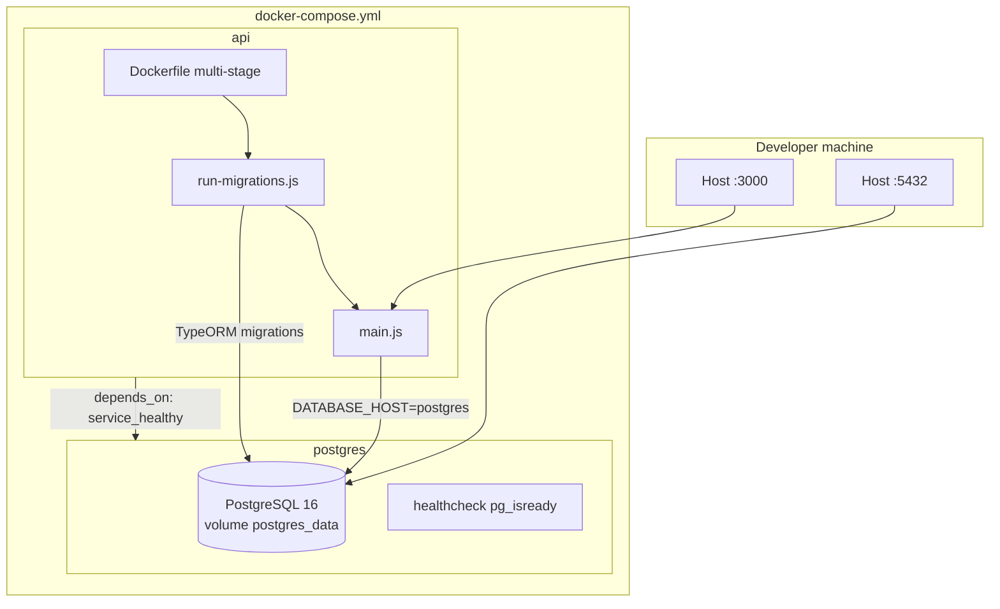

# Diagram: Docker Deployment

**Type:** Architecture / deployment  
**Tool:** Mermaid  
**Purpose:** Local stack with PostgreSQL and API container running migrations on startup.

---

## Diagram Code



---

## Startup sequence (API container)

1. `docker compose up --build` builds the multi-stage image (`node:22-alpine`).
2. Container CMD: `node dist/infrastructure/persistence/run-migrations.js`.
3. On success: `node dist/main.js` listens on port 3000.
4. PostgreSQL must pass `pg_isready` before the API starts.

## Key environment overrides (api service)

| Variable | Value in Docker |
|----------|-----------------|
| `DATABASE_HOST` | `postgres` |
| `DATABASE_SYNCHRONIZE` | `false` |
| `NODE_ENV` | `production` |

## Local dev (API on host)

```bash
docker compose up -d postgres
pnpm migration:run
pnpm start:dev
```

Use `DATABASE_HOST=localhost` in `.env` when the API runs on the host.

## References

- [`Dockerfile`](../../../Dockerfile)
- [`docker-compose.yml`](../../../docker-compose.yml)
- [Database migrations](../../wiki/Database-Migrations.md)
