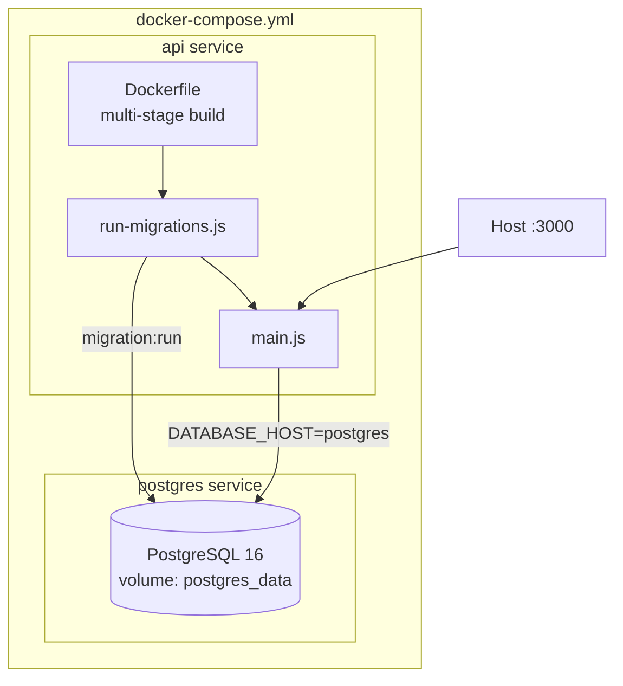

# Diagrama — Despliegue Docker

Stack local con docker-compose: PostgreSQL + API con migraciones al arranque.



## Flujo de arranque (API en Docker)

1. `docker compose up --build` construye imagen multi-stage.
2. Al iniciar el contenedor: `node dist/infrastructure/persistence/run-migrations.js`.
3. Si migraciones OK: `node dist/main.js`.
4. PostgreSQL debe estar healthy (`depends_on: condition: service_healthy`).

## Variables clave en contenedor

| Variable | Valor en Docker |
|----------|-----------------|
| `DATABASE_HOST` | `postgres` |
| `DATABASE_SYNCHRONIZE` | `false` |
| `NODE_ENV` | `production` |

## Desarrollo local (API en host)

```bash
docker compose up -d postgres   # solo BD
pnpm migration:run              # migraciones desde host
pnpm start:dev                  # API con ts-node
```

## Referencias

- [`Dockerfile`](../../../Dockerfile)
- [`docker-compose.yml`](../../../docker-compose.yml)
- [Database Migrations](../../wiki/Database-Migrations.md)
