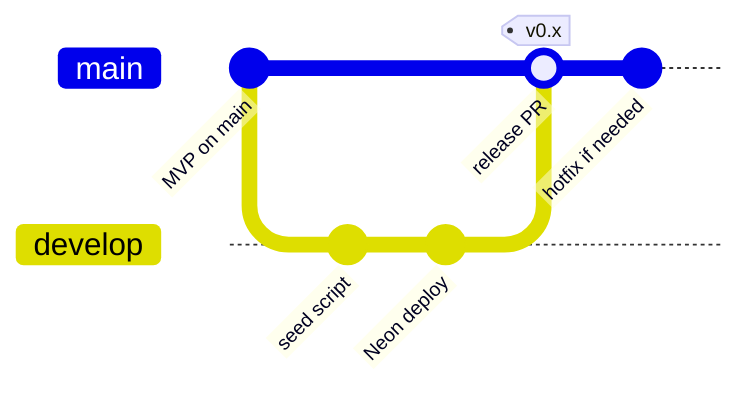

# Diagram: Git Branching Strategy

**Type:** Git graph  
**Tool:** Mermaid  
**Purpose:** Branch policy for MVP on `main` and future work on `develop`.

---

## Diagram Code

---

## Branches

| Branch | Purpose | CI triggers |
|--------|---------|-------------|
| `main` | Stable MVP — ready for frontend consumption | push / PR |
| `develop` | Integration: seed, deploy, advanced filters | push / PR |
| `feature/*` | Isolated work → PR to `develop` | via PR |

## Workflow

1. Branch from `develop` for each feature.
2. Open PR to `develop`; CI must pass (`typecheck`, `test:ci`, `build`, Docker image).
3. When a release set is ready, PR `develop` → `main`.

## Planned on `develop`

- Neon PostgreSQL + API hosting
- Colombian data seed script (user-owned)
- Advanced fruit filters (`?climate=`, `?department=`)

## References

- [Development workflow](../../wiki/Development-Workflow.md)
- [Roadmap](../../wiki/Roadmap.md)
