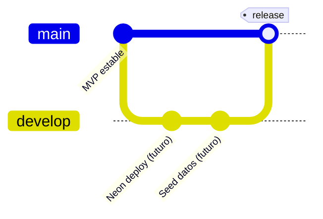

# Diagrama — Estrategia de ramas Git

Política de ramas para el proyecto.

## Ramas

| Rama | Propósito | Despliegue |
|------|-----------|------------|
| `main` | MVP estable, listo para frontend | Referencia de producción |
| `develop` | Features futuras, seed, despliegue | Integración continua |
| `feature/*` | Trabajo aislado | PR hacia `develop` |

## Flujo de trabajo

1. Crear rama desde `develop` para cada feature.
2. Abrir PR hacia `develop`; CI debe pasar.
3. Cuando un conjunto de features esté listo, PR de `develop` → `main`.

## Próximo trabajo en `develop`

- Despliegue Neon (PostgreSQL) + hosting API
- Seed de datos colombianos (usuario)
- Filtros avanzados en fruits

Ver [Development Workflow](../../wiki/Development-Workflow.md) y [Roadmap](../../wiki/Roadmap.md).
