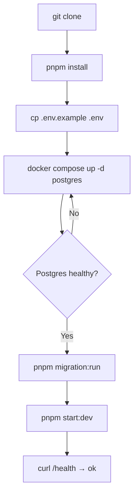

# Diagram: Local Installation Flow

**Type:** Flowchart  
**Tool:** Mermaid (`flowchart TD`)  
**Purpose:** Step-by-step local setup from clone to running API.

---

## Diagram

---

## Notes

- `pnpm start:dev` uses `ts-node` without hot reload.
- For full stack: `docker compose up --build` runs migrations on startup.
- Tables are empty after migrate — populate via Swagger or API.

## References

- [Installation (wiki)](../../wiki/Installation.md)
- [Environment variables](../../wiki/Environment-Variables.md)
