# Diagram: Database Migration Flow

**Type:** Flowchart  
**Tool:** Mermaid (`flowchart TD`)  
**Purpose:** Show migration:run, Docker startup, and revert paths.

---

## Diagram

```mermaid
flowchart TD
    subgraph dev ["Development"]
        D1["docker compose up -d postgres"]
        D2["pnpm migration:run"]
        D3["pnpm start:dev"]
        D1 --> D2 --> D3
    end

    subgraph docker ["Docker / production startup"]
        B1["node run-migrations.js"]
        B2["node main.js"]
        B1 --> B2
    end

    subgraph revert ["Revert last migration"]
        R1["pnpm migration:revert"]
        R2["Last migration undone"]
        R1 --> R2
    end

    subgraph reset ["Full reset (optional)"]
        X1["docker compose down -v"]
        X2["docker compose up -d postgres"]
        X3["pnpm migration:run"]
        X1 --> X2 --> X3
    end
```

---

## Notes

- `DATABASE_SYNCHRONIZE=false` in all environments.
- `pnpm migration:show` lists pending/applied migrations without changing state.
- Docker volume `postgres_data` persists data; `down -v` wipes it.

## References

- [Database migrations (wiki)](../../wiki/Database-Migrations.md)
- [`run-migrations.ts`](../../../src/infrastructure/persistence/run-migrations.ts)
