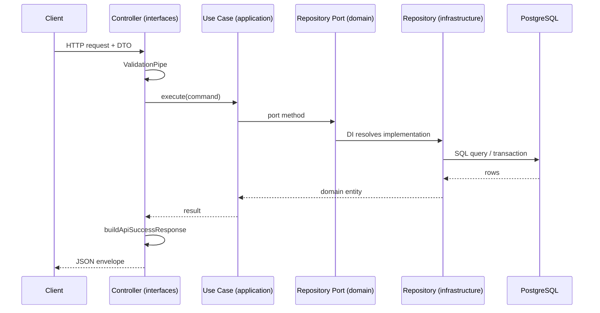

# Diagram: API Request Flow

**Type:** Sequence diagram  
**Tool:** Mermaid (`sequenceDiagram`)  
**Purpose:** Generic HTTP request path through Clean Architecture layers.

---

## Diagram

---

## Notes

- Errors from domain throw `DomainException` → `DomainExceptionFilter` maps to HTTP status.
- `GET /health` bypasses the envelope and `api/v1` prefix.
- Concrete example: [Create Fruit sequence](../04-sequence-create-fruit.md).

## References

- [API overview (wiki)](../../wiki/API-Overview.md)
- [Create Fruit flow (wiki)](../../wiki/Create-Fruit-Flow.md)
