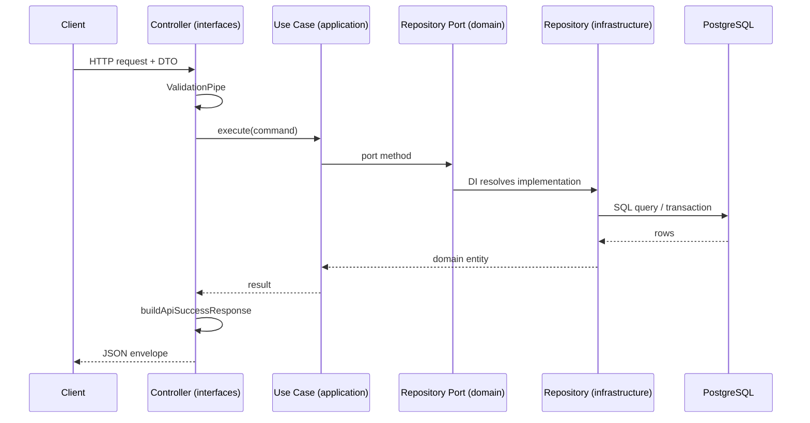

# API — Overview

Resumen del contrato HTTP de la Colombian Fruits API.

## Flujo de una petición HTTP



Ejemplo concreto con relaciones N:M: [[Create-Fruit-Flow]].

[Ver fuente en repo](https://github.com/JeansCordoba/Colombian_fruits/blob/main/docs/architecture/diagrams/09-api-request-flow.md)

## Base URL

| Recurso | URL |
|---------|-----|
| API | `http://localhost:3000/api/v1` |
| Swagger | `http://localhost:3000/api/docs` |
| Health | `http://localhost:3000/health` (sin prefijo `api/v1`) |

## Recursos disponibles (MVP)

| Recurso | Métodos | Notas |
|---------|---------|-------|
| `/health` | GET | Ping BD — sin envelope |
| `/departments` | CRUD | Incluye campo `code` |
| `/type-plants` | CRUD | Catálogo |
| `/type-fruits` | CRUD | Catálogo |
| `/climates` | CRUD | Catálogo |
| `/natural-regions` | CRUD | Catálogo |
| `/harvest-seasons` | CRUD | Solo `startMonth` / `endMonth` |
| `/families` | CRUD | Requiere `typePlantId` |
| `/fruits` | CRUD | Relaciones N:M; `search` en listado |

No hay autenticación en el MVP. Todas las rutas bajo `/api/v1` usan el envelope de éxito.

## Envelope de éxito

**Recurso único:**

```json
{
  "success": true,
  "data": { },
  "statusCode": 200
}
```

**Lista paginada:**

```json
{
  "success": true,
  "data": [],
  "meta": {
    "total": 0,
    "page": 1,
    "limit": 20,
    "totalPages": 0
  },
  "statusCode": 200
}
```

## Envelope de error

```json
{
  "statusCode": 404,
  "message": "Family with id 99 not found.",
  "error": "Not Found"
}
```

`message` puede ser `string` o `string[]` (validación de DTOs con `ValidationPipe`).

## Paginación

Query params en listados (`page`, `limit`):

- `page` — default `1`
- `limit` — default `20`, máximo `100` (`MAX_LIMIT` en código)
- `search` — opcional solo en `GET /api/v1/fruits`

## Soft delete

`DELETE` en catálogos, families y fruits marca `deleted_at`. Respuesta `204 No Content` sin body.

## Swagger

Documentación interactiva en `/api/docs`. Generada desde decoradores `@nestjs/swagger` en controllers.

## Contrato completo

Ver [endpoints.md en el repo](https://github.com/JeansCordoba/Colombian_fruits/blob/main/docs/api/endpoints.md).

## Siguiente paso

- [[Testing]]
- [[Study-04-Patrones-Estructurales]] — DTOs y envelope
