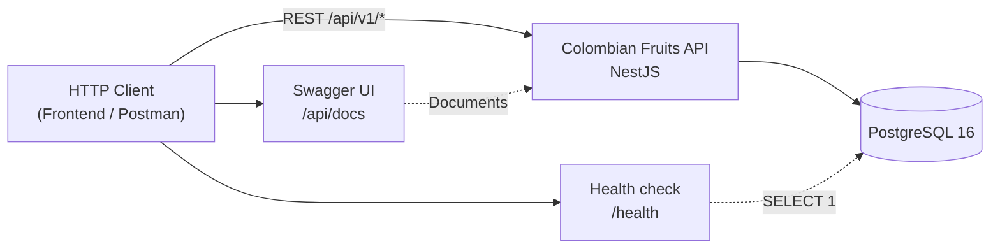
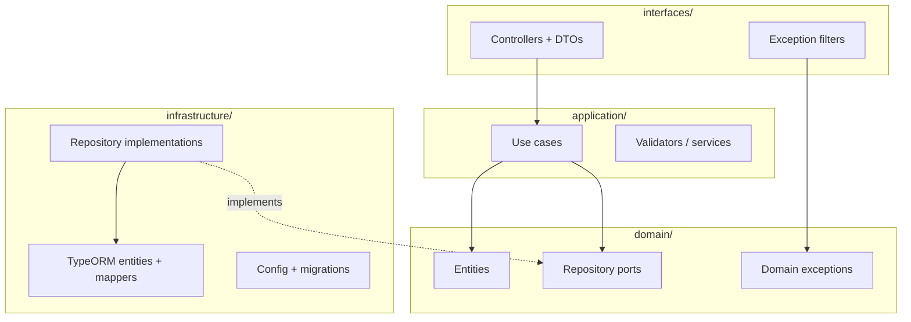
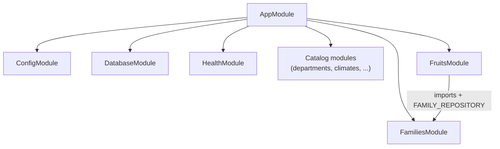

# Arquitectura

Resumen de la arquitectura del proyecto. Para profundizar, consulta la [documentación técnica en el repositorio](https://github.com/JeansCordoba/Colombian_fruits/tree/main/docs/architecture).

## Clean Architecture + layer-first

```
interfaces → application → domain ← infrastructure
```

| Capa | Carpeta | Responsabilidad |
|------|---------|-----------------|
| Domain | `src/domain/` | Entidades, puertos, excepciones (`DomainException`) |
| Application | `src/application/` | Use cases, validadores |
| Infrastructure | `src/infrastructure/` | TypeORM, config, migraciones |
| Interfaces | `src/interfaces/` | Controllers, DTOs, filtros HTTP |

## Contexto del sistema



[Ver fuente en repo](https://github.com/JeansCordoba/Colombian_fruits/blob/main/docs/architecture/diagrams/01-system-context.md)

## Capas y dependencias



[Ver fuente en repo](https://github.com/JeansCordoba/Colombian_fruits/blob/main/docs/architecture/diagrams/02-clean-architecture-layers.md)

## Módulos NestJS



[Ver fuente en repo](https://github.com/JeansCordoba/Colombian_fruits/blob/main/docs/architecture/diagrams/04-nestjs-modules.md)

## Flujo de ejemplo: Create Fruit

Diagrama de secuencia del caso de uso principal: [[Create-Fruit-Flow]].

## Más diagramas (en el repositorio)

| Diagrama | Tema | Enlace |
|----------|------|--------|
| 03-entity-relationship | ERD | [Ver en repo](https://github.com/JeansCordoba/Colombian_fruits/blob/main/docs/architecture/diagrams/03-entity-relationship.md) |
| 05-deployment-docker | Docker Compose | [Ver en repo](https://github.com/JeansCordoba/Colombian_fruits/blob/main/docs/architecture/diagrams/05-deployment-docker.md) |
| 06-git-branching | Ramas Git | [Ver en repo](https://github.com/JeansCordoba/Colombian_fruits/blob/main/docs/architecture/diagrams/06-git-branching.md) |
| 07-installation-flow | Instalación local | [Ver en repo](https://github.com/JeansCordoba/Colombian_fruits/blob/main/docs/architecture/diagrams/07-installation-flow.md) |
| 08-migration-flow | Migraciones | [Ver en repo](https://github.com/JeansCordoba/Colombian_fruits/blob/main/docs/architecture/diagrams/08-migration-flow.md) |
| 09-api-request-flow | Request HTTP genérico | [Ver en repo](https://github.com/JeansCordoba/Colombian_fruits/blob/main/docs/architecture/diagrams/09-api-request-flow.md) |

## Bounded contexts

- **Catálogos:** departments, climates, type-plants, type-fruits, natural-regions, harvest-seasons
- **Families:** familias botánicas ligadas a type-plants
- **Fruits:** agregado principal con relaciones N:M

## ADRs

Decisiones arquitectónicas: [docs/architecture/adr/](https://github.com/JeansCordoba/Colombian_fruits/tree/main/docs/architecture/adr).

## Aprendizaje

Para explicaciones en lenguaje sencillo: [[Study-Home]].
