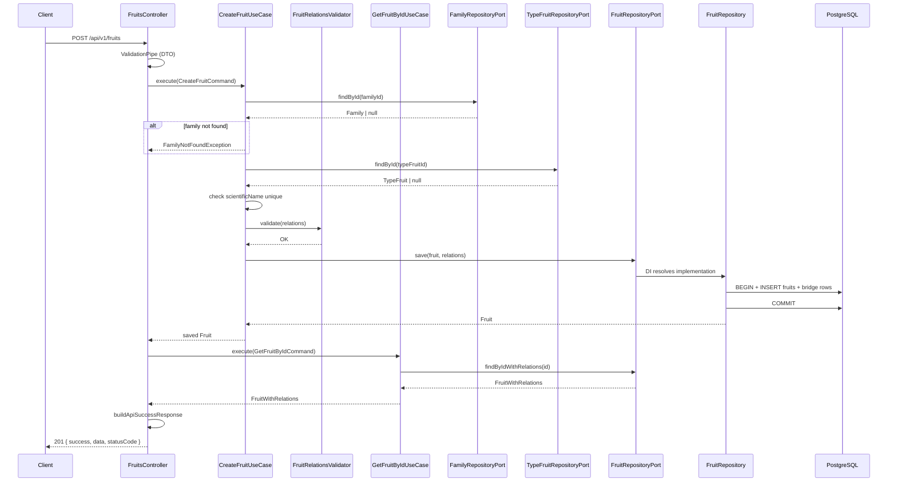

# Flujo Create Fruit

Secuencia completa del caso de uso `CreateFruit`: validación de DTO, FKs N:M, persistencia transaccional y re-fetch con envelope de respuesta.

## Diagrama de secuencia

## Participantes

| Participante | Capa | Responsabilidad |
|--------------|------|-----------------|
| `FruitsController` | interfaces | Valida DTO, delega al use case, re-fetch, envelope |
| `CreateFruitUseCase` | application | Orquesta reglas, valida FKs, persiste |
| `FruitRelationsValidator` | application | Valida que IDs N:M existen |
| `GetFruitByIdUseCase` | application | Re-fetch con relaciones post-create |
| `FruitRepositoryPort` | domain | Contrato de persistencia |
| `FruitRepository` | infrastructure | TypeORM + transacción N:M |

## Errores esperados

| Código | Condición |
|--------|-----------|
| `400` | DTO inválido (`ValidationPipe`) |
| `404` | FK no existe |
| `409` | `scientificName` duplicado |
| `422` | Regla de dominio incumplida |

## Ver fuente / profundizar

- [Secuencia CreateFruit en el repo](https://github.com/JeansCordoba/Colombian_fruits/blob/main/docs/architecture/04-sequence-create-fruit.md)
- [[Architecture]] — capas y módulos
- [[API-Overview]] — envelope HTTP
