# Migraciones de base de datos

El proyecto usa **TypeORM migrations** con `DATABASE_SYNCHRONIZE=false` en todos los entornos.

## Flujo de migraciones

```mermaid
flowchart TD
    subgraph dev ["Development"]
        D1["docker compose up -d postgres"]
        D2["pnpm migration:run"]
        D3["pnpm start:dev"]
        D1 --> D2 --> D3
    end

    subgraph docker ["Docker / production startup"]
        B1["node run-migrations.js"]
        B2["node main.js"]
        B1 --> B2
    end

    subgraph revert ["Revert last migration"]
        R1["pnpm migration:revert"]
        R2["Last migration undone"]
        R1 --> R2
    end

    subgraph reset ["Full reset (optional)"]
        X1["docker compose down -v"]
        X2["docker compose up -d postgres"]
        X3["pnpm migration:run"]
        X1 --> X2 --> X3
    end
```



[Ver fuente en repo](https://github.com/JeansCordoba/Colombian_fruits/blob/main/docs/architecture/diagrams/08-migration-flow.md)

## Scripts disponibles

| Comando | Descripción |
|---------|-------------|
| `pnpm migration:run` | Aplica migraciones pendientes |
| `pnpm migration:revert` | Revierte la última migración |
| `pnpm migration:show` | Muestra estado de migraciones |

## Flujo de desarrollo

```bash
docker compose up -d postgres
pnpm migration:run
pnpm start:dev
```

Tras migrar, las tablas están **vacías**. No existe script de seed en este repositorio. Pobla catálogos vía API hasta que implementes tu propio seed en `develop`.

## Archivos clave

| Archivo | Rol |
|---------|-----|
| `src/infrastructure/persistence/data-source.ts` | DataSource para CLI TypeORM |
| `src/infrastructure/persistence/run-migrations.ts` | Script de arranque en Docker/prod |
| `src/infrastructure/persistence/orm-entities.ts` | Barrel de entidades ORM |
| `src/infrastructure/persistence/migrations/` | Migraciones versionadas |

## Docker / producción

El `Dockerfile` ejecuta:

```bash
node dist/infrastructure/persistence/run-migrations.js && node dist/main.js
```

`start:prod` en `package.json` sigue el mismo patrón.

## Volúmenes Docker

PostgreSQL persiste datos en el volumen `postgres_data`. Para resetear:

```bash
docker compose down -v   # ⚠️ borra todos los datos
docker compose up -d postgres
pnpm migration:run
```

## Migración desde `synchronize=true`

Si usaste `DATABASE_SYNCHRONIZE=true` previamente:

1. Haz backup de datos si los necesitas.
2. `docker compose down -v` para limpiar esquema inconsistente.
3. Configura `DATABASE_SYNCHRONIZE=false`.
4. `pnpm migration:run`.

Ver [[Troubleshooting]] para más detalle.

## Siguiente paso

- [[Installation]]
- [[Roadmap]]
