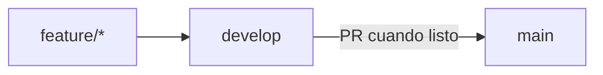

# Flujo de desarrollo

Convenciones de trabajo en el repositorio.

## Ramas

| Rama | Propósito |
|------|-----------|
| `main` | MVP estable, listo para frontend |
| `develop` | Integración de features, despliegue, seed |
| `feature/*` | Trabajo aislado → PR a `develop` |



## Convención de commits

Formato: `tipo(alcance): descripción`

| Tipo | Uso |
|------|-----|
| `feat` | Nueva funcionalidad |
| `fix` | Corrección de bug |
| `test` | Tests |
| `docs` | Documentación |
| `chore` | Mantenimiento |

Ejemplos del MVP:

```
feat(families): add full CRUD stack with typePlant nested response
feat(infra): add TypeORM migrations and data-source CLI
fix(families): export FAMILY_REPOSITORY for FruitsModule DI
docs: update documentation, diagrams, wiki and Study learning section
```

## CI

GitHub Actions ejecuta en push/PR a `main` y `develop`:

1. `pnpm typecheck`
2. `pnpm test:ci`
3. `pnpm build`
4. Build de imagen Docker

## Verificación local antes de PR

```bash
pnpm typecheck && pnpm test:ci && pnpm build && pnpm test:e2e
```

## Roadmap

Ver [[Roadmap]] para trabajo futuro en `develop`.
