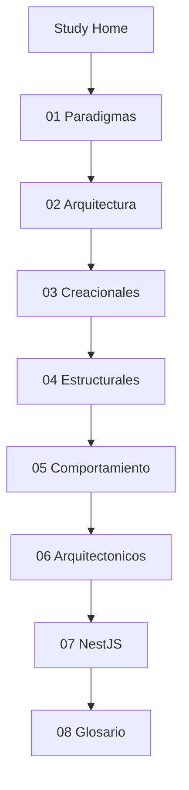

# Study — Índice de aprendizaje

Sección para desarrolladores junior. Explica conceptos del proyecto en lenguaje sencillo, con ejemplos reales del código en `src/`.

## Para quién es esta sección

- Acabas de clonar el repo y quieres entender **por qué** hay cuatro carpetas (`domain`, `application`, `infrastructure`, `interfaces`).
- Conoces NestJS básico pero no has visto Clean Architecture aplicada.
- Prefieres español y analogías antes de leer los ADRs en inglés.

## Ruta de lectura sugerida

## Páginas

1. [[Study-01-Paradigmas]] — OOP, async/await, TypeScript tipado
2. [[Study-02-Arquitectura-Software]] — Clean Architecture y regla de dependencias
3. [[Study-03-Patrones-Creacionales]] — Inyección de dependencias con tokens
4. [[Study-04-Patrones-Estructurales]] — Repository, Mapper, DTO, Read Model
5. [[Study-05-Patrones-Comportamiento]] — Use Case, Command, Validator
6. [[Study-06-Patrones-Arquitectonicos]] — Layer-first, soft delete, transacciones N:M
7. [[Study-07-NestJS-En-Este-Proyecto]] — Módulos, pipes y filters en la práctica
8. [[Study-08-Glosario-Rapido]] — Términos → archivos concretos

## Cómo usar esta sección con el código

1. Lee una página de Study.
2. Abre el archivo que cita (ruta bajo `src/`).
3. Sigue un flujo completo: [[Create-Fruit-Flow]] o `fruits.controller.ts` → `create-fruit.use-case.ts` → `fruit.repository.ts`.
4. Prueba el endpoint en Swagger: http://localhost:3000/api/docs

## Documentación avanzada (inglés, en el repo)

Esta sección **resume** conceptos. Para profundizar:

- [Patrones de diseño](https://github.com/JeansCordoba/Colombian_fruits/blob/main/docs/architecture/05-design-patterns.md)
- [ADRs](https://github.com/JeansCordoba/Colombian_fruits/tree/main/docs/architecture/adr)
- [Secuencia CreateFruit](https://github.com/JeansCordoba/Colombian_fruits/blob/main/docs/architecture/04-sequence-create-fruit.md)

## Volver

- [[Home]]
