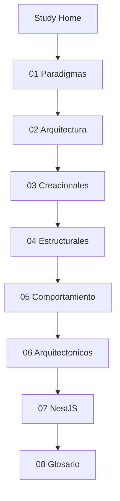

# Study — Índice de aprendizaje

Sección para desarrolladores junior. Explica conceptos del proyecto en lenguaje sencillo, con ejemplos reales del código.

## Ruta de lectura sugerida

## Páginas

1. [01-Paradigmas](Study-01-Paradigmas) — OOP, async/await
2. [02-Arquitectura-Software](Study-02-Arquitectura-Software) — Clean Architecture
3. [03-Patrones-Creacionales](Study-03-Patrones-Creacionales) — DI con tokens
4. [04-Patrones-Estructurales](Study-04-Patrones-Estructurales) — Repository, Mapper, DTO
5. [05-Patrones-Comportamiento](Study-05-Patrones-Comportamiento) — Use Case, Command
6. [06-Patrones-Arquitectonicos](Study-06-Patrones-Arquitectonicos) — Layer-first, soft delete
7. [07-NestJS-En-Este-Proyecto](Study-07-NestJS-En-Este-Proyecto) — Módulos en la práctica
8. [08-Glosario-Rapido](Study-08-Glosario-Rapido) — Términos → archivos

## Documentación avanzada (repo)

Esta sección **resume** conceptos. Para profundizar, usa los enlaces al repositorio (no funcionan rutas relativas desde la wiki):

- [Patrones de diseño](https://github.com/JeansCordoba/Colombian_fruits/blob/main/docs/architecture/05-design-patterns.md)
- [ADRs](https://github.com/JeansCordoba/Colombian_fruits/tree/main/docs/architecture/adr)
- [Secuencia CreateFruit](https://github.com/JeansCordoba/Colombian_fruits/blob/main/docs/architecture/04-sequence-create-fruit.md)

## Volver

- [Wiki Home](Home)
