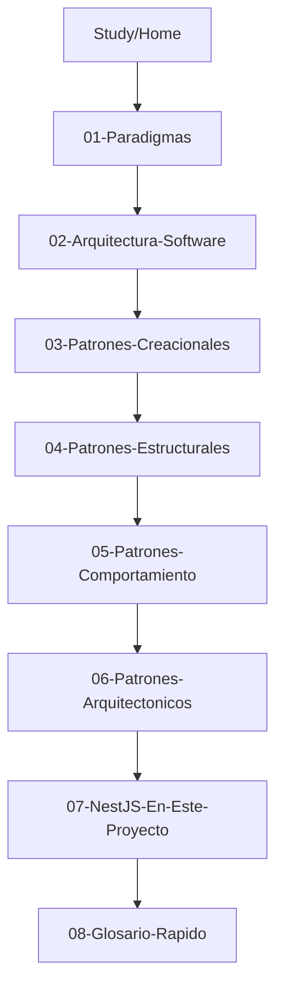

# Study — Índice de aprendizaje

Sección para desarrolladores junior. Explica conceptos del proyecto en lenguaje sencillo, con ejemplos reales del código.

## Ruta de lectura sugerida

## Páginas

1. [01-Paradigmas](01-Paradigmas) — OOP, async/await
2. [02-Arquitectura-Software](02-Arquitectura-Software) — Clean Architecture
3. [03-Patrones-Creacionales](03-Patrones-Creacionales) — DI con tokens
4. [04-Patrones-Estructurales](04-Patrones-Estructurales) — Repository, Mapper, DTO
5. [05-Patrones-Comportamiento](05-Patrones-Comportamiento) — Use Case, Command
6. [06-Patrones-Arquitectonicos](06-Patrones-Arquitectonicos) — Layer-first, soft delete
7. [07-NestJS-En-Este-Proyecto](07-NestJS-En-Este-Proyecto) — Módulos en la práctica
8. [08-Glosario-Rapido](08-Glosario-Rapido) — Términos → archivos

## Documentación avanzada

Esta sección **resume** conceptos. Para profundizar:

- [Patrones de diseño](../../architecture/05-design-patterns.md)
- [ADRs](../../architecture/adr/)
- [Secuencia CreateFruit](../../architecture/04-sequence-create-fruit.md)

## Volver

- [Wiki Home](../Home)
